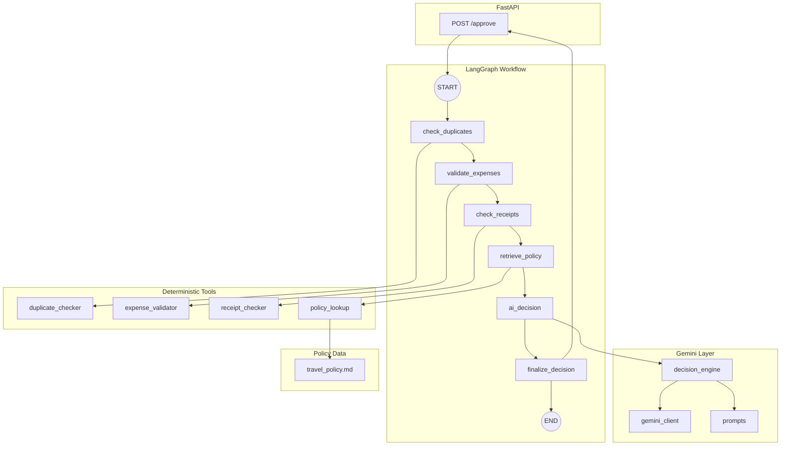

# Travel Reimbursement Approval Agent

An AI-assisted travel reimbursement approval system built with **FastAPI**, **LangGraph**, and **Google Gemini 2.5 Flash**. Deterministic Python tools validate claims against company policy; Gemini performs structured reasoning over those facts and retrieved policy context to produce auditable approval decisions.

---
## Demo

See the screenshots inside the `/demo` folder.
 
## Architecture

The system follows a **tool-first, reason-second** design:

1. **Deterministic tools** compute facts (limits, receipts, duplicates, policy sections).
2. **LangGraph** orchestrates the workflow as an explicit state machine.
3. **Gemini** reasons over tool outputs and policy text — it does not recalculate limits.
4. **Rule-based fallback** ensures the API never fails when Gemini is unavailable.

This separation keeps decisions explainable, testable, and production-safe.



---

## Folder Structure

```
travel-reimbursement-agent/
├── app/
│   ├── main.py                 # FastAPI application & routes
│   ├── config.py               # Settings (GOOGLE_API_KEY via pydantic-settings)
│   ├── models.py               # Pydantic domain models
│   ├── agent/
│   │   ├── graph.py            # LangGraph workflow & nodes
│   │   └── state.py            # AgentState TypedDict
│   ├── tools/
│   │   ├── duplicate_checker.py
│   │   ├── expense_validator.py
│   │   ├── receipt_checker.py
│   │   └── policy_lookup.py
│   ├── llm/
│   │   ├── gemini_client.py    # Google GenAI SDK wrapper
│   │   ├── prompts.py          # Decision prompt templates
│   │   └── decision_engine.py  # Prompt build + JSON parsing
│   └── policy/
│       └── travel_policy.md    # Company travel reimbursement policy
├── tests/                      # Pytest suite (unit, integration, edge cases)
├── scripts/
│   └── run_e2e_scenarios.py    # 22 end-to-end scenario runner
├── pytest.ini
├── .env.example
└── README.md
```

---

## Workflow

A single `POST /approve` request triggers the full LangGraph pipeline:

| Step | Node | `current_step` | Output stored in state |
|------|------|----------------|------------------------|
| 1 | `check_duplicates` | `duplicate_check` | `duplicate_result` |
| 2 | `validate_expenses` | `expense_validation` | `validation_result` |
| 3 | `check_receipts` | `receipt_validation` | `receipt_result` |
| 4 | `retrieve_policy` | `policy_lookup` | `policy_context`, `policy_section_titles` |
| 5 | `ai_decision` | `ai_decision` | `ai_decision` |
| 6 | `finalize_decision` | `decision_complete` | `final_decision` |

The API returns `final_decision` as an `ApprovalDecision` JSON object.

---

## LangGraph Nodes

### `check_duplicates`
Detects duplicate line items within a claim, repeated `claim_id` submissions, and identical expense fingerprints across trips.

### `validate_expenses`
Enforces policy limits and category rules:
- Hotel max ₹5,000/night
- Meals max ₹1,500/day
- Allowed transport (taxi, metro, bus, train)
- Personal fuel rejected
- Foreign currency and unsupported categories flagged for manual review

### `check_receipts`
Requires receipts for INR expenses above ₹500.

### `retrieve_policy`
Keyword-scores policy sections and returns the top 3 most relevant sections with titles for citation.

### `ai_decision`
Calls `decision_engine.generate_ai_decision()` with all tool outputs and policy context. Stores Gemini's structured decision in `ai_decision`.

### `finalize_decision`
Returns `ai_decision` if present; otherwise applies the rule-based fallback.

---

## Gemini Integration

| Component | Role |
|-----------|------|
| `gemini_client.py` | Cached `genai.Client`, model `gemini-2.5-flash`, JSON response mode |
| `prompts.py` | Builds prompt with claim, tool outputs, policy text, and section titles |
| `decision_engine.py` | Invokes Gemini, parses strict JSON, validates into `ApprovalDecision` |

**Prompt rules enforced:**
- Use only provided policy context — no hallucinated rules
- Cite only retrieved section titles in explanations
- Prefer `manual_review` for ambiguous cases
- Treat validator outputs as authoritative facts

**Expected Gemini JSON:**

```json
{
  "decision": "approved | rejected | partially_approved | manual_review",
  "approved_amount": 4500,
  "rejected_amount": 0,
  "missing_documents": [],
  "violated_policies": [],
  "confidence": 0.95,
  "explanation": "Human-readable rationale referencing policy sections."
}
```
---

## Assumptions
- Mock company policy
- Mock employee claims
- Static reimbursement limits
## Limitations
- No database persistence
- No authentication
- Mock receipt validation
- No OCR support
- No human approval workflow
  
---

## Deterministic Validators

Validators live in `app/tools/` and are **never replaced by the LLM**:

| Tool | Function | Purpose |
|------|----------|---------|
| `duplicate_checker` | `check_duplicates(claim)` | Duplicate detection |
| `expense_validator` | `validate_expenses(expenses)` | Limits, categories, transport rules |
| `receipt_checker` | `check_receipts(expenses)` | Receipt documentation |
| `policy_lookup` | `lookup_policy(query)` | Top-K policy section retrieval |

Gemini receives their outputs as read-only facts.

---

## Fallback Strategy

If Gemini fails at any point in `ai_decision`:

1. Error is logged and appended to `state["errors"]`
2. `ai_decision` is set to `None`
3. `finalize_decision` applies `_build_rule_based_decision()`:

| Condition | Fallback decision |
|-----------|-------------------|
| Duplicates detected | `manual_review` |
| `manual_review` from validator | `manual_review` |
| Missing receipts | `manual_review` |
| Policy violations | `rejected` |
| All checks pass | `approved` |

The API always returns a valid `ApprovalDecision` — no unhandled exceptions reach the client.

---

## Installation

### Prerequisites

- Python 3.11+
- Google Gemini API key

### Setup

```bash
# Clone and enter project
cd travel-reimbursement-agent

# Create virtual environment
python -m venv travenv
travenv\Scripts\activate        # Windows
# source travenv/bin/activate   # macOS/Linux

# Install dependencies
pip install fastapi uvicorn langgraph pydantic pydantic-settings python-dotenv google-genai pytest httpx
```

---

## Environment Variables

Create `.env` in the project root or `app/.env`:

```env
GOOGLE_API_KEY=your-gemini-api-key-here
```

| Variable | Required | Description |
|----------|----------|-------------|
| `GOOGLE_API_KEY` | Yes | Google Gemini API key |

Configuration is loaded via `app/config.py` using `pydantic-settings` and `python-dotenv`.

---

## Running

```bash
# Start the API server
uvicorn app.main:app --reload --host 0.0.0.0 --port 8000
```

| Endpoint | URL |
|----------|-----|
| API root | http://127.0.0.1:8000/ |
| Health check | http://127.0.0.1:8000/health |
| Swagger UI | http://127.0.0.1:8000/docs |
| ReDoc | http://127.0.0.1:8000/redoc |

---

## Swagger

Open **http://127.0.0.1:8000/docs** to explore and test the API interactively.

Available endpoints:

- `GET /` — Service metadata
- `GET /health` — Health check
- `POST /approve` — Submit a travel claim for AI-assisted approval

---

## Example API

### Request

```bash
curl -X POST "http://127.0.0.1:8000/approve" \
  -H "Content-Type: application/json" \
  -d '{
    "claim_id": "CLM-2026-001",
    "employee_id": "EMP001",
    "employee_name": "Jane Doe",
    "department": "Engineering",
    "trip_start_date": "2026-03-01",
    "trip_end_date": "2026-03-05",
    "destination": "Delhi, India",
    "purpose": "Client workshop",
    "expenses": [
      {
        "category": "hotel",
        "amount": "4500",
        "currency": "INR",
        "description": "Hotel stay near client office",
        "receipt_attached": true
      },
      {
        "category": "transport",
        "amount": "350",
        "currency": "INR",
        "description": "Uber taxi to client site",
        "receipt_attached": true
      }
    ]
  }'
```

### Response

```json
{
  "decision": "approved",
  "approved_amount": "4850",
  "rejected_amount": "0",
  "missing_documents": [],
  "violated_policies": [],
  "confidence": 0.95,
  "explanation": "All expenses comply with travel policy. Hotel within ₹5,000 limit per ## 4. Hotel Accommodation."
}
```

### Decision values

| Value | Meaning |
|-------|---------|
| `approved` | Claim fully approved |
| `rejected` | Claim rejected due to policy violations |
| `partially_approved` | Some expenses approved, some rejected |
| `manual_review` | Requires human reviewer (ambiguous, duplicate, foreign currency, missing receipts) |

---

## Testing

### Unit & integration tests

```bash
# Full suite (69 tests)
python -m pytest tests -v

# Specific suites
python -m pytest tests/test_expense_validator.py -v
python -m pytest tests/test_graph_integration.py -v
python -m pytest tests/test_edge_cases.py -v
```

### End-to-end scenarios

```bash
python scripts/run_e2e_scenarios.py
```

Runs 22 realistic scenarios against `POST /approve` with a summary table (Request, Expected, Actual, PASS/FAIL, execution time).

### Test coverage

| Area | Test file |
|------|-----------|
| Expense validation | `test_expense_validator.py` |
| Receipt checking | `test_receipt_checker.py` |
| Duplicate detection | `test_duplicate_checker.py` |
| Policy lookup | `test_policy_lookup.py` |
| Gemini decision engine | `test_decision_engine.py` |
| API endpoints | `test_api.py` |
| LangGraph workflow | `test_graph_integration.py` |
| Edge cases & stability | `test_edge_cases.py` |

---

## Future Improvements

- **Persistent claim store** — Replace in-memory duplicate registry with a database
- **Vector policy retrieval** — Embedding-based RAG for large policy corpora
- **Human-in-the-loop** — Pause graph at `manual_review` for reviewer UI
- **Audit trail** — Persist full `AgentState` per request for compliance
- **Multi-currency conversion** — Official exchange rates for foreign expenses
- **Role-based approval matrix** — Auto-route by claim amount (manager/finance)
- **Observability** — OpenTelemetry tracing across LangGraph nodes
- **Streaming responses** — `graph.stream()` exposed via SSE for real-time progress
- **Policy versioning** — Track which policy version was applied per decision

---

## License

Internal use / assignment project.
